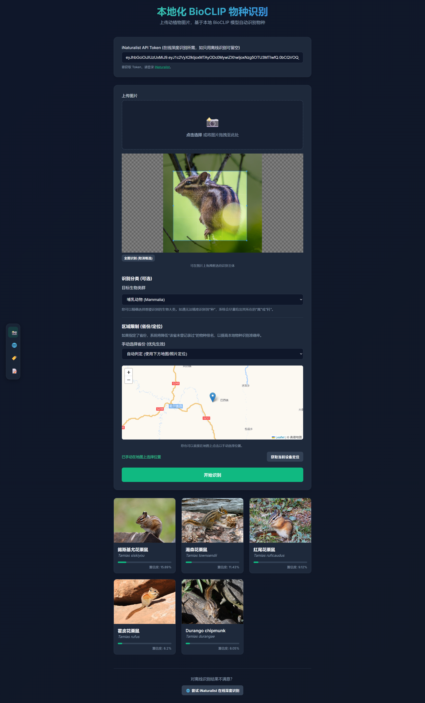
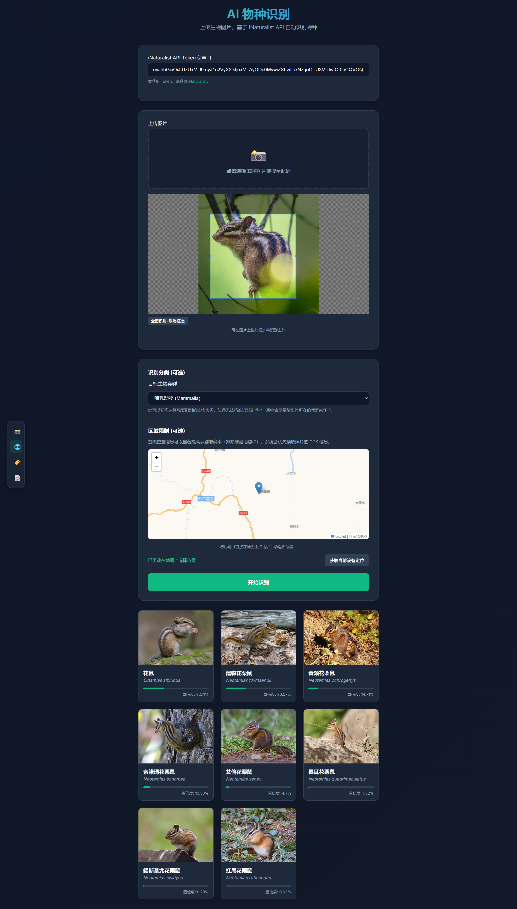
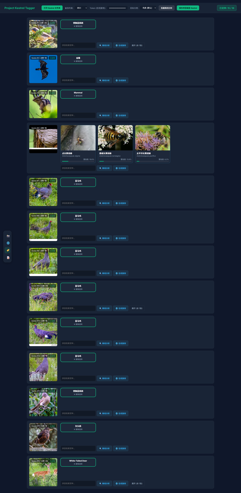
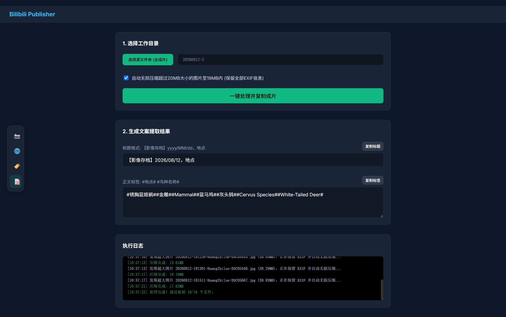

# BioVision-Toolkit

[English](README_en.md) | [简体中文](README.md)

基于本地 BioCLIP 模型开发的物种识别系统，集成 iNaturalist API 进行专业的动植物识别。该项目支持完全本地化/离线运行，并附带一系列用于图像批量打标和媒体发布的小工具。

## 🌟 核心功能

1. **📸 AI 物种识别 (专业离线版)**
   - 上传动植物图片，利用本地 BioCLIP 模型进行快速识别。
   - 支持在图片上拖拽框选待识别的主体。
   - **识别分类筛选**：可精确选择识别的生物大类（如植物、鸟类、昆虫等），如无法精确到“种”，系统会尽量定位到“属”或“科”。
   - **区域限制优化**：指定省份或在地图上点击定位，系统会自动降低该地区未曾记录过物种的排名，大幅提高本地物种识别的准确率。



2. **🌐 AI 物种识别 (在线备用版)**
   - 作为离线版的补充，当本地资源受限或需要其他接口支持时使用。



3. **🏷️ Kestrel 批量打标**
   - 高效管理和批量处理图像数据，为物种数据快速添加标签。



4. **📝 Bilibili 发布助手**
   - 专为 B站 (Bilibili) 创作者设计，帮助快速生成并发布有关物种识别的动态或视频内容。



## 🚀 快速启动

本项目提供两种部署方式：**Docker**（推荐）和 **Windows 本地运行**。

### 方式一：Docker 环境启动（推荐）
本项目已配置完善的 Docker 运行环境，可直接部署并避免繁杂的依赖配置。

1. **环境准备**：确保您的设备已安装 [Docker](https://www.docker.com/) 和 [Docker Compose](https://docs.docker.com/compose/)。
2. **启动服务**：在项目根目录执行以下命令，后台启动程序：
   ```bash
   docker-compose up -d --build
   ```
3. **访问系统**：程序启动后，请在浏览器中访问：👉 **[http://localhost:29844/](http://localhost:29844/)**

### 方式二：Windows 无 Docker 环境启动
如果您没有安装 Docker，也可以在 Windows 系统下通过本地脚本一键启动。脚本会自动创建虚拟环境并安装所需依赖。

1. **环境准备**：确保您的系统已安装 **Python 3.8 或以上版本**，并在安装时勾选了 `Add to PATH`。
2. **启动服务**：双击运行项目根目录下的 `start.bat` 文件。首次运行会自动下载依赖并进入交互式控制台菜单，支持以下操作：
   - `[1]` 🚀 启动 Web 服务
   - `[2]` 🔄 重新构建终极数据库
   - `[3]` 🖼️ 下载缺失鸟类图片
3. **访问系统**：在控制台输入 `1` 启动服务后，请在浏览器中访问：👉 **[http://127.0.0.1:8000/](http://127.0.0.1:8000/)**
   *(注意：本地启动默认使用 8000 端口，与 Docker 版的 29844 有所区分)*

## ⚙️ 获取 iNaturalist Token
为了充分使用 API 的特性，建议配置 iNaturalist Token：
- 请登录并访问 [iNaturalist API Token 页面](https://www.inaturalist.org/users/api_token) 获取。

## 🛠️ 技术栈
- **后端**：Python, FastAPI, BioCLIP (PyTorch)
- **部署**：Docker / Docker Compose
- **其他机制**：自动下载和构建离线数据库机制、基于 APScheduler 的后台维护任务等。